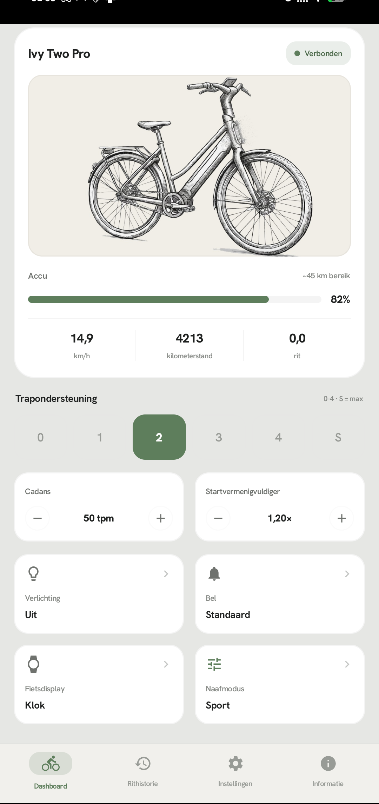
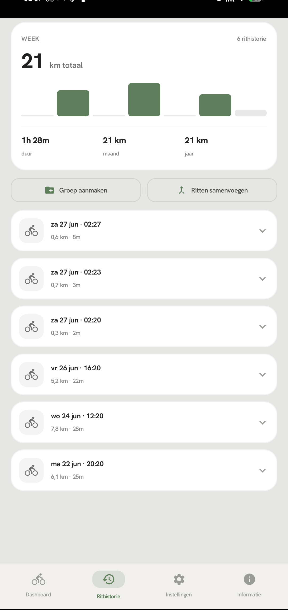
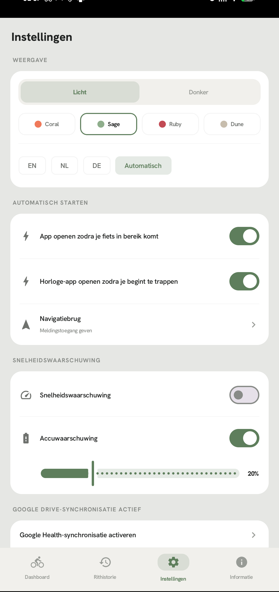
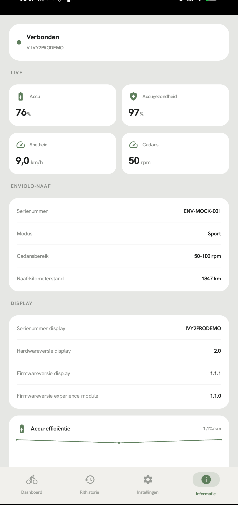
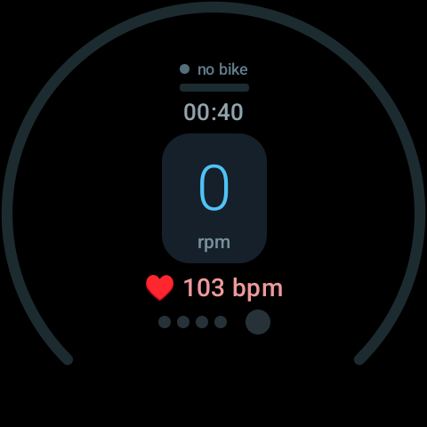

[🇳🇱 Nederlands](README.md) | [🇩🇪 Deutsch](README.de.md) | [🇬🇧 English](README.en.md)

# VeloGappie

Unabhängige Android-App für Veloretti-V2-E-Bikes.
Kein Konto nötig — verbindet sich direkt mit deinem Fahrrad über Bluetooth.

## Download

Fertige APKs findest du auf der [Releases-Seite](../../releases/latest).
Kein Play-Store-Konto nötig — einfach herunterladen und installieren.

## Was es ist

VeloGappie kommuniziert direkt mit deinem Fahrrad über Bluetooth — kein
Veloretti-Konto, keine Cloud-Abhängigkeit. Deine Fahrtdaten bleiben auf deinem
Telefon. Optionale Funktionen wie Wetter auf dem Fahrraddisplay und Google-Drive-Backup
nutzen das Netzwerk, aber nichts geht an Velorettis Server.

## Was es nicht ist

VeloGappie ist kein offizielles Veloretti-Produkt und kein Ersatz für die offizielle App.
Es gibt keine Garantie, dass alles korrekt funktioniert. Die Nutzung erfolgt auf eigenes
Risiko.

## Screenshots

| Dashboard | Fahrtenspeicher | Einstellungen | Information |
|-----------|-----------------|---------------|-------------|
|  |  |  |  |

| Wear OS |
|---------|
|  |

## Warum VeloGappie?

| | Offizielle Veloretti-App | VeloGappie |
|---|---|---|
| Konto erforderlich | Ja | Nein |
| Veloretti-Cloud erforderlich | Ja | Nein |
| Fahrtenspeicher mit GPS | Nein | Ja |
| Wear-OS-Unterstützung | Nein | Ja |
| Health Connect | Nein | Ja |
| Navigation zum Fahrraddisplay | Eingeschränkt | Google Maps, Komoot, Waze |
| Open Source | Nein | Ja (GPL-3.0) |

## Features

### Steuerung
- **Motorunterstützung** Stufe 0–5 (einschließlich Superhero-Modus)
- **Beleuchtung** — manuell an/aus oder automatisch bei Sonnenuntergang
- **Digitale Klingel** (Standard- oder Ping-Ton)
- **Trittfrequenzkalibrierung** — exakte 1-U/min-Schritte per Schieberegler

### Enviolo-Nabe
- Eco / Comfort / Sport Fahrmodi
- Startmultiplikator einstellen (0,00–2,55×)
- Nabendiagnostik — Seriennummer, Artikelnummer, Trittfrequenzbereich, Naben-Kilometerstand

### Fahrraddisplay
- **Uhr** — Uhrzeit auf dem Display in normalem oder großem Zweifeldformat
- **Herzfrequenz** — live BPM von der Uhr, oder abwechselnd mit Uhr
- **Live-Wetter** — Temperatur, Niederschlag und Symbol ans Fahrraddisplay
- **Navigationspfeile** mit Entfernung in Metern ans Display senden
- **Freitext** — bis zu 10 Zeichen auf dem Display (z. B. Straßenname)

### Daten
- Akkustand, Gesundheit, Ladestatus
- Geschwindigkeit, Höchstgeschwindigkeit, Trittfrequenz
- Kilometerstand und Fahrtdistanz
- Firmwareversionen (Display + Experience-Modul)

### Fahrtenspeicher
- Lokale Speicherung von Fahrten (Distanz, Dauer, Durchschnitts-/Höchstgeschwindigkeit, Herzfrequenz, Trittfrequenz)
- **GPS-Routen** — pro Fahrt wird die Route aufgezeichnet und als Karte in den Fahrtdetails angezeigt
- **Höhenmeter und Akku** — Höhengewinn und Akkuverbrauch (Start → Ende) pro Fahrt
- **Fahrtgruppen** — Fahrten bündeln (z. B. Radurlaub, Pendelstrecke)
- Fahrten zusammenführen, löschen, zu Gruppen hinzufügen/entfernen
- **Health Connect** — schreibt automatisch Radsport-Aktivitäten mit direktem Link aus den Fahrtdetails
- **Google-Drive-Backup** — optionale Synchronisierung von Einstellungen und Fahrtenspeicher

### Navigationsbrücke
- Leitet Abbiegehinweise von Google Maps, Komoot, Waze, OsmAnd und mehr an das Fahrraddisplay weiter
- Automatische Richtungserkennung (links/rechts/geradeaus/wenden) und Entfernung
- Mehrsprachige Unterstützung (NL/EN/DE)

### Launch Control
- Langer Druck auf die Lenkertaste setzt Motorunterstützung und Enviolo-Übersetzung auf Maximum
- Schaltet automatisch zurück, sobald die Höchstgeschwindigkeit erreicht ist

### Wear-OS-Companion
- Live-Geschwindigkeit, Distanz, Dauer, Herzfrequenz am Handgelenk
- Trittfrequenzregelung über die Krone der Uhr
- Doppeltippen zum Umschalten der Beleuchtung
- Ambient-Always-on-Modus
- Herzfrequenzsensor der Uhr

## Installation

Dies ist ein Standard-Android-Studio-Projekt (Kotlin + Jetpack Compose).

1. Öffne den Ordner `app/` in Android Studio
2. Lass Gradle synchronisieren
3. Build & Run auf einem Telefon mit Android 8.0+ (API 26)
4. Für die Uhr-App: Build des `:wear`-Moduls und Installation auf einem Wear-OS-3+-Gerät

Beide Module verwenden einen gemeinsamen `debug.keystore`, damit die Wear OS Data Layer
sie koppeln kann. Dies ist ein Standard-Android-Debug-Schlüssel (Passwort: `android`),
kein Geheimnis.

**Voraussetzungen:** Android SDK 34, JDK 17, Gradle 8.7+

## Verwendung

1. Öffne die App und erteile Bluetooth- und Standortberechtigungen
2. Tippe auf **Nach Fahrrädern suchen** — dein Fahrrad erscheint als `V-<Seriennummer>`
3. Tippe auf dein Fahrrad, um die Verbindung herzustellen
4. Das Dashboard zeigt sofort Akkustand, Geschwindigkeit und Steuerungsmöglichkeiten
5. Wische zu den anderen Tabs für Fahrtenspeicher, Einstellungen und technische Infos

Die Standortberechtigung wird ausschließlich für die automatische Beleuchtung
(Sonnenuntergangsberechnung) verwendet. Dein Standort wird nirgendwohin gesendet.

## Kompatibilität

Für Veloretti-V2-E-Bikes, die über BLE als `V-<Seriennummer>` senden.
V1-Fahrräder verwenden ein anderes Protokoll und werden nicht unterstützt.

## Mitwirken

Issues und Pull Requests sind willkommen. Wenn du einen Bug findest oder ein Feature
hinzufügen möchtest, eröffne bitte zuerst ein Issue zur Diskussion.

## Lizenz

GPL-3.0 — siehe [LICENSE](LICENSE).

## Haftungsausschluss

Diese App ist **nicht mit Veloretti B.V. verbunden und nicht von Veloretti B.V.
genehmigt.** Die Nutzung erfolgt vollständig auf eigenes Risiko. Der Entwickler haftet
nicht für Schäden am Fahrrad, Verlust der Garantie oder Softwarefehler, die durch
Bluetooth-Befehle verursacht werden.

„Veloretti" und „Ivy" sind Marken der Veloretti B.V. „Enviolo" ist eine Marke von
Enviolo. Alle Markennamen sind Eigentum ihrer jeweiligen Inhaber.

## Schriftart

Verwendet [Hanken Grotesk](https://fonts.google.com/specimen/Hanken+Grotesk)
(SIL Open Font License).
